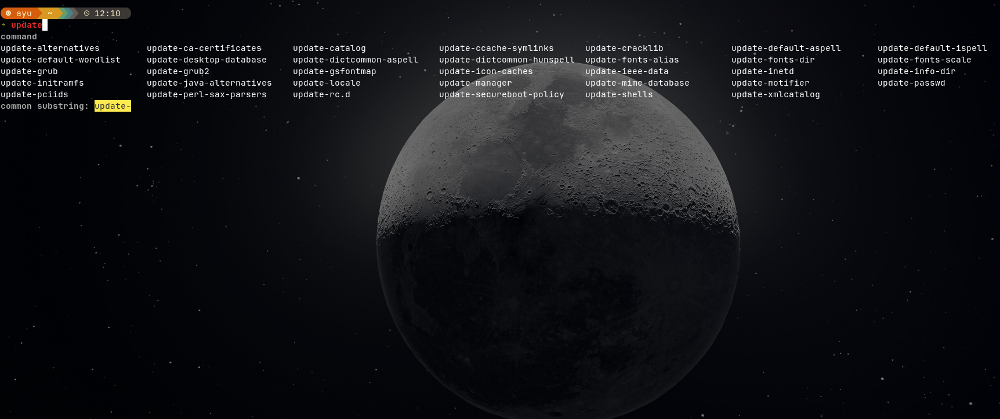
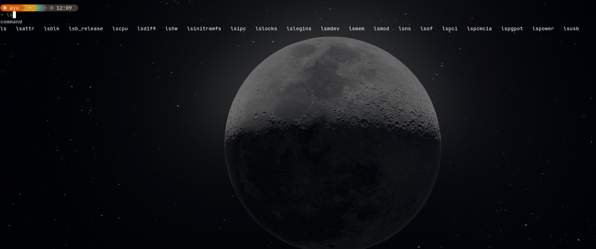
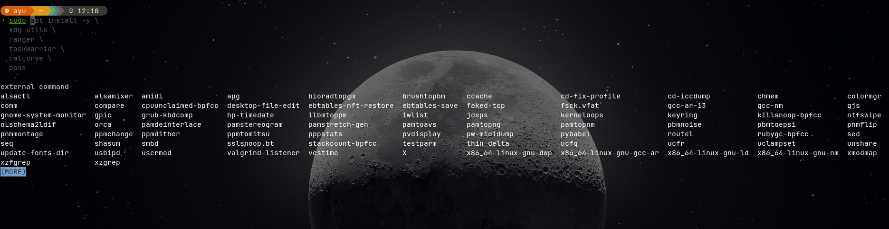

# ⚡ Ubuntu's awesome Zsh Setup

A blazing fast and minimal Zsh setup powered by ⚡ **Zinit**, 🚀 **Starship**, 🔍 **fzf**, 🧠 **Autosuggestions**, 🖌️ **Syntax Highlighting**, and more.

---

## 🌟 Features

- 🚀 Asynchronous plugin loading (via Zinit)
- 🌈 Beautiful prompt with Starship
- 🧠 Smart autosuggestions and syntax highlighting
- 🔍 Fuzzy finder navigation (fzf)
- 📂 Instant directory jumping with Zoxide
- 🧰 Developer-friendly aliases and tools

---

## 📦 Tech Stack

| Tool                  | Role                              |
|-----------------------|-----------------------------------|
| Zinit                 | Plugin manager                    |
| Starship              | Minimal fast prompt               |
| fzf                   | Fuzzy finder                      |
| zoxide                | Directory jumper                  |
| zsh-autosuggestions   | Fish-style suggestions            |
| zsh-syntax-highlighting | Command syntax coloring        |
| zsh-autocomplete      | Smart completion engine           |
| eza, bat, ugrep       | Better CLI alternatives           |

---

## 📸 Screenshots

| Prompt | View |
|--------|------|
| Prompt 1 |  |
| Prompt 2 |  |
| Prompt 3 |  |

---

## ⚙️ Installation

Clone and run the install script:

```bash
git clone https://github.com/codewithayuu/zsh-backup.git ~/Downloads/zsh-backup
cd ~/Downloads/zsh-backup
chmod +x install-zsh.sh
./install-zsh.sh
source ~/.zshrc


## 🧹 Uninstallation


```bash
./uninstall-zsh.sh
```

This script will:

* Restore your default shell to **Bash**
* Remove:

  * `.zshrc`
  * Zinit plugins and configs
  * fzf and its configs
  * NVM and Node paths
  * Starship binary and its config
  * JetBrainsMono Nerd Font files
  * Zoxide binary and data
* Clear font cache for a clean terminal state

---

### ⚠️ Warning

This **permanently deletes** all related configs and binaries.
If you made personal edits, **back them up** before running.

---


