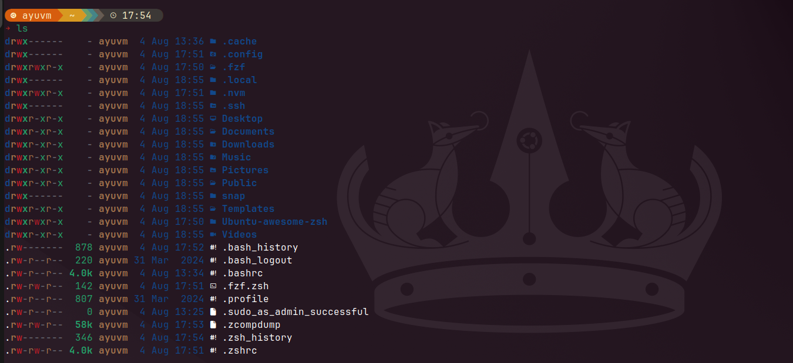

# ⚡ Ubuntu's Awesome Zsh Setup

A blazing fast and minimal Zsh setup powered by ⚡ **Zinit**, 🚀 **Starship**, 🔍 **fzf**, 🧠 **Autosuggestions**, 🖌️ **Syntax Highlighting**, and more.

---

## 🌟 Features

- 🚀 Asynchronous plugin loading (via Zinit)
- 🌈 Beautiful prompt with Starship
- 🧠 Smart autosuggestions and syntax highlighting
- 🔍 Fuzzy finder navigation (fzf)
- 📂 Instant directory jumping with Zoxide
- 🧰 Developer-friendly aliases and tools

---

## 📦 Tech Stack

| Tool                      | Role                            |
|---------------------------|---------------------------------|
| Zinit                     | Plugin manager                  |
| Starship                  | Minimal fast prompt             |
| fzf                       | Fuzzy finder                    |
| Zoxide                    | Directory jumper                |
| zsh-autosuggestions       | Fish-style suggestions          |
| zsh-syntax-highlighting   | Command syntax coloring         |
| zsh-autocomplete          | Smart completion engine         |
| eza, bat, ugrep           | Better CLI alternatives         |

---

## 📸 Screenshots

| Prompt    | View                                |
|-----------|-------------------------------------|
| Prompt 1  |         |
| Prompt 2  |         |
| Prompt 3  |         |
| Prompt 4  |         |

---

## ⚙️ Installation

Clone and run the install script:

```bash
git clone https://github.com/codewithayuu/Ubuntu-awesome-zsh.git ~/MyRepo/Ubuntu-awesome-zsh
cd ~/MyRepo/Ubuntu-awesome-zsh
chmod +x install-zsh.sh
./install-zsh.sh
source ~/.zshrc
````

This script will:

* Install Zsh, fzf, zoxide, eza, bat, ugrep, and Starship
* Set Zsh as your default shell
* Download and apply the **JetBrainsMono Nerd Font**
* Apply the **Starship gruvbox-rainbow preset**
* Copy and apply all Zsh-related config files

---

## ♻️ Uninstallation

To remove everything and restore your default environment:

```bash
./uninstall-zsh.sh
```

This script will:

* Restore your default shell to **Bash**
* Remove:

  * `.zshrc`
  * Zinit plugins and configs
  * fzf and its configs
  * NVM and Node paths
  * Starship binary and its config
  * JetBrainsMono Nerd Font files
  * Zoxide binary and data
* Clear the font cache

### ⚠️ Warning

This **permanently deletes** all related configs and binaries.
If you’ve made personal edits, **back them up first**.

---

## 💬 FAQs

* ❓ **Script failed during installation?**
  Just rerun the script. It's idempotent and safe.

* ❓ **Prompt/theme not applied after install?**
  Log out and log back in, or restart the terminal.

* ❓ **Missing a package?**
  Manually install it via:

  ```bash
  sudo apt install <package-name>
  ```

* ❓ **Icons not showing properly?**
  Change your terminal font to **JetBrainsMono Nerd Font** after installation.

---

## 📎 License

MIT — use it freely, modify as needed. Star the repo if you find it helpful ⭐

```


